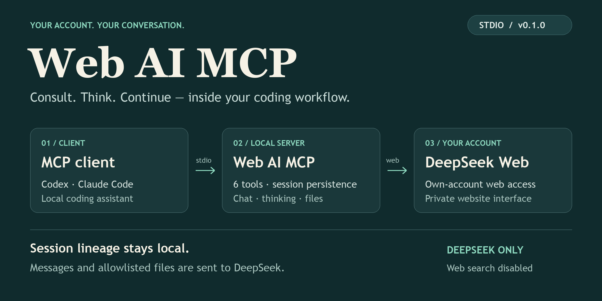
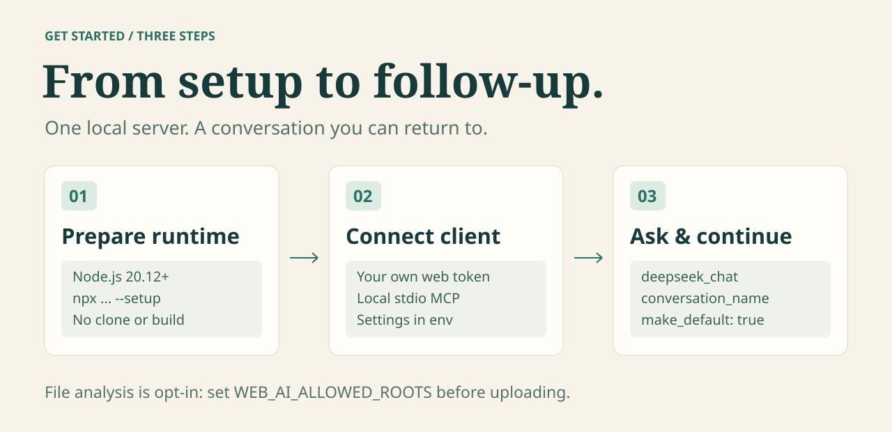

# Web AI MCP

[](https://github.com/983033995/web-ai-mcp/actions/workflows/ci.yml)



通过 MCP，让本机 AI 编程助手调用**你自己的 DeepSeek 网页账号**，进行聊天、深度思考、文件分析和多轮讨论。

适用于咨询代码、比较方案、持续讨论项目的场景。当前提供本地 **stdio MCP server**，仅实现 DeepSeek Web；Doubao 和其他网站仍是扩展预留。

> **状态：npm 已发行，当前发行版本 v0.1.2。** 项目自身代码采用 MIT，支持 npm/npx 安装与 GitHub Release 自动发布（OIDC，无长期 npm token）。首次版本 v0.1.1 已完成 registry 发布；v0.1.2 更新发行说明。已有网站验证见[验证记录](docs/LOCAL_VALIDATION.md)，历史验证不保证后续私有接口稳定。上游 WASM 不随 npm 包分发，其再分发许可仍未确认。

## 目录

- [功能与边界](#功能与边界)
- [快速开始](#快速开始)
- [接入 MCP 客户端](#接入-mcp-客户端)
- [工具与调用示例](#工具与调用示例)
- [环境变量](#环境变量)
- [会话持久化与恢复](#会话持久化与恢复)
- [常见问题](#常见问题)
- [开发与验证](#开发与验证)
- [隐私、安全与许可](#隐私安全与许可)
- [项目结构与文档](#项目结构与文档)

## 功能与边界

| 能力 | 当前状态 |
| --- | --- |
| DeepSeek 网页聊天 | 已实现，使用本人网站登录凭据 |
| 深度思考 | 已实现，可选择显示网站返回的思考文本 |
| 多轮续聊 | 已实现，本地 ID、命名会话、项目默认会话及重启恢复 |
| 文件分析 | 已实现，仅允许上传显式授权目录内的文件 |
| 会话管理 | 已实现，列出或关闭本地会话映射 |
| 网站搜索 | 未启用，`search_enabled` 固定为 `false` |
| Doubao / 其他网站 | 未实现，不可调用 |
| HTTP / 远程多用户 MCP | 未实现，仅支持本地 stdio |

本项目不是 DeepSeek 官方 API 客户端、OpenAI 兼容代理或 CLIProxyAPI 插件。它提供咨询工具，不会自行修改代码或执行 DeepSeek 返回的建议，也不提供公共免费 API 服务。

## 快速开始



### 1. 准备运行环境

需要 Node.js **20.12 或以上**、npm，以及访问 npm、GitHub 原始文件和 DeepSeek 网站的网络，建议使用受支持的 Node.js LTS。npm 包已经编译，不需要 Git、克隆项目或手动构建。

先准备一次 PoW WASM（不需要网站 token）：

```bash
npx -y web-ai-mcp@0.1.2 --setup
```

首次启动也会自动准备；显式执行 `--setup` 可避免客户端下载时间叠加 MCP 启动超时。WASM 从固定上游提交下载到本机缓存并校验 SHA-256，不写入 npm 安装目录，也不随包分发。后续版本更新请明确修改配置中的版本号。

npx 会自动安装已编译的包，不需要克隆项目或运行构建命令。npm 安装不执行下载脚本；仅在 `--setup` 或服务初始化缺少本机 WASM 时下载。可通过 `WEB_AI_WASM_PATH` 指定同哈希的本机文件，来源说明见 [THIRD_PARTY_NOTICES.md](THIRD_PARTY_NOTICES.md)。

### 2. 获取本人网站凭据

1. 在浏览器登录 [DeepSeek 网站](https://chat.deepseek.com)，确认能够正常聊天。
2. 打开开发者工具 → **Application（应用）→ Local Storage（本地存储）→ `https://chat.deepseek.com`**。
3. 找到 `userToken`，仅在本机复制其 token 值。若显示为 JSON，取其中实际 token 字符串；不要复制整个对象、引号或 `Bearer ` 前缀。

这是网站登录凭据，**不是** DeepSeek 开放平台 API key。网站可能调整存储形式；若找不到该字段，不要把整份浏览器存储、Cookie 或请求头发到 Issue 中。

### 3. 直接在 MCP 配置中填写参数（推荐）

**不需要创建 `.env` 文件。** 在支持 `mcpServers` 的客户端配置中，添加 `web-ai-mcp`，把网站 token 放在 `env` 中即可。最小可用配置：

```json
{
  "mcpServers": {
    "web-ai-mcp": {
      "type": "stdio",
      "command": "npx",
      "args": ["-y", "web-ai-mcp@0.1.2"],
      "env": {
        "DEEPSEEK_USER_TOKEN": "YOUR_OWN_DEEPSEEK_WEB_TOKEN"
      }
    }
  }
}
```

将 token 占位值替换为本人网站 token。如果已有 `mcpServers`，只合并其中的 `web-ai-mcp` 项，不覆盖其他服务。Codex 使用 TOML，完整示例见下一节。

| 配置位置 | 填什么 | 例子 |
| --- | --- | --- |
| `command` / `args` | 启动服务的命令、包名和 CLI 选项 | `npx`、`-y`、`web-ai-mcp@0.1.2` |
| `env` | 服务启动时的配置，值都用字符串 | `DEEPSEEK_USER_TOKEN`、`WEB_AI_PROJECT_ROOT` |
| 每次工具调用的 JSON | 本轮问题、会话选择或文件列表 | `message`、`conversation_name`、`file_paths` |

不要把 token、上传目录等自定义键直接放在 `web-ai-mcp` 顶层，也不用把 token 放到 `args` 中。`env` 由客户端传给服务，当前 v0.1.2 已支持，无需升级。

真实 token 只能保存在本机私有配置中，不要提交含 token 的 `.mcp.json` 或 `.codex/config.toml`。要共享项目配置时，使用下文的环境变量转发或可选 `.env` 方式。

### 4. 连接客户端并开始使用

按下一节配置一个客户端，重新加载 MCP 连接，然后尝试：

> 调用 `webai_providers` 查看可用服务，再调用 `deepseek_chat`，询问“请用一句话介绍你能帮我做什么”。

发现六个工具说明本地连接成功；收到聊天答案才说明当前账号的网站请求成功。

## 接入 MCP 客户端

选择你使用的客户端示例即可，不需要同时配置多种方式。客户端会启动和管理服务进程，无需另外运行 `npm start`；修改 `env` 后重启 MCP 连接。

### JSON 配置：Claude Code 与同类客户端

只聊天时，使用上面的最小配置。需要项目续聊、文件分析或更长超时时，在**同一个 `env` 对象**中加入对应变量。常用完整配置如下：

```json
{
  "mcpServers": {
    "web-ai-mcp": {
      "type": "stdio",
      "command": "npx",
      "args": ["-y", "web-ai-mcp@0.1.2"],
      "env": {
        "DEEPSEEK_USER_TOKEN": "YOUR_OWN_DEEPSEEK_WEB_TOKEN",
        "WEB_AI_PROJECT_ROOT": "/absolute/path/to/your-project",
        "WEB_AI_ALLOWED_ROOTS": "/absolute/path/to/your-project/docs",
        "DEEPSEEK_TIMEOUT": "120000",
        "WEB_AI_SESSION_TTL_MINUTES": "0"
      }
    }
  }
}
```

| 参数 | 必填吗 | 怎样填写 |
| --- | --- | --- |
| `DEEPSEEK_USER_TOKEN` | 必填 | 本人网站 token，不带 `Bearer ` 前缀 |
| `WEB_AI_PROJECT_ROOT` | 推荐 | 正在讨论的项目绝对路径；用于固定会话存储位置，不是 npm 包安装路径 |
| `WEB_AI_ALLOWED_ROOTS` | 文件分析时才需要 | 允许上传的目录；只聊天可删除这一行或设为 `""` |
| `DEEPSEEK_TIMEOUT` | 可选 | 整轮网站操作超时，毫秒；默认 `"60000"`，示例为 120 秒 |
| `WEB_AI_SESSION_TTL_MINUTES` | 可选 | 默认 `"0"`，不设本地会话过期；正数表示闲置分钟数 |

目录与 token 占位值都需要替换。macOS / Linux 多个上传目录用 `:` 分隔，Windows 用 `;`；Windows 路径推荐 `C:/Projects/demo/docs`，也可以把反斜杠写成 `\\`。服务不会自动上传项目目录，仅在调用文件工具并选中文件时上传。

把 `.web-ai-mcp/` 加入所讨论项目的 `.gitignore`，不要共享不同账号的会话存储。客户端如果有独立的工具超时选项，应大于 `DEEPSEEK_TIMEOUT`；这项属于客户端设置，不能代替服务的超时变量。

Claude Code 的项目级文件是 `.mcp.json`；含真实 token 的配置不要提交。若需要共享这个文件，可将 token 值写成 `"${DEEPSEEK_USER_TOKEN}"`，由 Claude Code 的运行环境注入；变量替换是否受支持以各客户端文档为准，不要把这种写法原样套用到所有客户端。首次使用按提示批准项目 MCP，参考 [Claude Code MCP 文档](https://code.claude.com/docs/en/mcp)。

### Codex：TOML 配置

在本机 `~/.codex/config.toml` 中添加，保留已有内容：

```toml
[mcp_servers.web-ai-mcp]
command = "npx"
args = ["-y", "web-ai-mcp@0.1.2"]
startup_timeout_sec = 60
tool_timeout_sec = 180

[mcp_servers.web-ai-mcp.env]
DEEPSEEK_USER_TOKEN = "YOUR_OWN_DEEPSEEK_WEB_TOKEN"
WEB_AI_PROJECT_ROOT = "/absolute/path/to/your-project"
WEB_AI_ALLOWED_ROOTS = "/absolute/path/to/your-project/docs"
DEEPSEEK_TIMEOUT = "120000"
WEB_AI_SESSION_TTL_MINUTES = "0"
```

只聊天时可删除 `WEB_AI_ALLOWED_ROOTS`。`startup_timeout_sec` 和 `tool_timeout_sec` 是 Codex 的超时选项，单位秒；`DEEPSEEK_TIMEOUT` 是本服务的变量，单位毫秒。

如果不想把 token 写入配置文件，可在上面的主表增加 `env_vars = ["DEEPSEEK_USER_TOKEN"]`，并删除 `[mcp_servers.web-ai-mcp.env]` 中的 token 行；这样 Codex 转发自己运行环境中的变量。从桌面启动的 Codex 未必继承终端里的 `export`。参考 [Codex 官方 MCP 文档](https://developers.openai.com/codex/mcp)。

### 可选：使用 `.env` 文件

只有你希望把参数集中保存在独立本机文件中时才需要此方式。用编辑器创建 `/absolute/path/to/web-ai.env`：

```dotenv
DEEPSEEK_USER_TOKEN=YOUR_OWN_DEEPSEEK_WEB_TOKEN
WEB_AI_PROJECT_ROOT=/absolute/path/to/your-project
```

将 JSON 配置中的启动参数改为下面的值，并删除重复的 `env` 参数：

```json
{
  "args": [
    "-y", "web-ai-mcp@0.1.2",
    "--env-file", "/absolute/path/to/web-ai.env"
  ]
}
```

这段仅用于替换已有服务的 `args` 字段，不是完整客户端配置。其他可选变量仍可放进文件中。服务不会自动查找 `.env`；只有传入 `--env-file` 才加载。若同时使用 `env` 和文件，同名参数以进程环境中的值为准，见 [Node.js 加载规则](https://nodejs.org/api/cli.html#--env-filefile)。

### 其他客户端与启动问题

使用相同 npx 启动参数和 `env`；配置文件位置、外层字段及启用方式以客户端文档为准。这是本机 stdio 配置，不是 HTTP MCP 地址。桌面客户端找不到 `npx` 时，把 `command` 换成本机 npx 可执行文件路径；某些 Windows 客户端需要填写 `npx.cmd`。

## 工具与调用示例

以下 JSON 是 **MCP 工具参数**，不是终端命令或 HTTP 请求。可以让 AI 助手调用对应工具，也可以通过 MCP Inspector 手动传入。

| 工具 | 作用 | 必填参数 |
| --- | --- | --- |
| `deepseek_chat` | 普通聊天，可开启思考并续聊 | `message` |
| `deepseek_reasoner` | 始终启用网站思考模式，可续聊 | `message` |
| `deepseek_analyze_files` | 上传并分析允许目录内的本地文件 | `file_paths` |
| `deepseek_sessions_list` | 列出未过期的本地会话 ID、名称和状态 | 无，传 `{}` |
| `deepseek_session_close` | 删除本地映射；不删除网站历史 | `conversation_id` 或 `session_key` |
| `webai_providers` | 查看已实现与预留的 provider | 无，传 `{}` |

### 普通聊天与项目讨论

调用 `deepseek_chat`，创建命名会话并设为项目默认：

```json
{
  "message": "请比较进程内缓存和 Redis 的取舍。",
  "conversation_name": "architecture-review",
  "make_default": true
}
```

之后不传会话选择参数，即继续默认会话：

```json
{
  "message": "如果只有单实例部署，你会怎样调整建议？"
}
```

若希望创建独立讨论，传入一个**从未使用过的** `conversation_name`。已有名称会续聊；没有选择参数且没有项目默认会话时，每次调用会创建新会话。

聊天与思考工具的参数：

| 参数 | 默认值 / 行为 |
| --- | --- |
| `message` | 必填，非空字符串 |
| `conversation_id` | 可选，工具返回的本地 UUID，用于续聊 |
| `session_key` | `conversation_id` 的兼容别名，二者代表同一 ID |
| `conversation_name` | 可选，去除首尾空白后 1–80 字符；首次创建，之后复用 |
| `make_default` | 可选，`true` 时在成功获得可续聊结果后设为项目默认；`false` 不清除已有默认 |
| `system_prompt` | 可选，作为普通文本前缀拼接到本轮消息，**不是独立 system role** |
| `thinking` | 仅 `deepseek_chat` 支持，默认 `false`；`deepseek_reasoner` 固定启用 |
| `show_reasoning` | 默认 `false`；`true` 时附带网站返回的思考文本（如有） |

`conversation_name` 不能与 ID 同时传入。若同时传 `conversation_id` 和 `session_key`，值必须一致。

### 深度思考

调用 `deepseek_reasoner`，在前面的命名会话中继续分析：

```json
{
  "message": "请推演缓存失效、并发更新和服务重启的边界情况。",
  "conversation_name": "architecture-review",
  "show_reasoning": true
}
```

`show_reasoning` 只控制是否返回网站可见的思考片段，不影响思考模式开关，也不保证网站一定返回思考文本。当前工具会聚合完整答案后返回，不向 MCP 客户端逐字流式输出。

### 文件分析与追问

先配置 `WEB_AI_ALLOWED_ROOTS` 并重启连接，再调用 `deepseek_analyze_files`：

```json
{
  "file_paths": ["/absolute/path/to/your-project/docs/design.md"],
  "instruction": "请检查方案的假设、潜在问题与可以简化的地方。",
  "thinking": true
}
```

`instruction` 可省略，默认“请分析这些文件并提供改进建议。”；`thinking` 默认 `false`。

- 必须使用绝对文件路径；解析符号链接后的真实路径也必须在允许目录内。
- 每次最多 **5 个文件**，每个不超过 **10 MiB**，总量不超过 **20 MiB**，仅接受普通文件。
- 文件实际上传到 DeepSeek 网站；可接受的格式及解析结果还受网站限制，不保证任意文件均可解析。
- 每次文件分析都创建独立的网站会话，当前不支持传入已有会话 ID、名称或设置项目默认。

成功且网站返回有效消息 ID 时，答案末尾包含同值的 `session_key` 与 `conversation_id`。后续用 `deepseek_chat` 或 `deepseek_reasoner` 追问：

```json
{
  "message": "请基于刚才的文件，列出优先级最高的三项改进。",
  "conversation_id": "00000000-0000-4000-8000-000000000000"
}
```

上面的 UUID 仅示意，必须替换为**实际返回的 ID**，否则会报未知会话错误。返回的是 MCP 文本内容：答案、可选思考文本、本地 ID 或警告；不是包含这些字段的固定 JSON 响应对象。

### 列出与关闭会话

调用 `deepseek_sessions_list`，参数为 `{}`。关闭时调用 `deepseek_session_close`：

```json
{
  "conversation_id": "00000000-0000-4000-8000-000000000000"
}
```

同样替换为实际 ID。关闭只删除本地映射；若它是项目默认，会一并清除默认绑定。网站历史仍保留，需要在网站自行管理。

## 环境变量

| 变量 | 默认值 | 说明 |
| --- | --- | --- |
| `DEEPSEEK_USER_TOKEN` | 无，必填 | 本人 DeepSeek 网站 token；未配置则启动失败 |
| `DEEPSEEK_TIMEOUT` | `60000` | 正整数，单位毫秒；覆盖单次网站操作的 PoW、上传、解析与响应读取 |
| `WEB_AI_PROJECT_ROOT` | 服务进程工作目录 | 项目会话存储基准目录，建议使用绝对路径 |
| `WEB_AI_SESSION_STORE_PATH` | `<项目目录>/.web-ai-mcp/sessions.json` | 覆盖私有会话存储位置，建议使用绝对路径 |
| `WEB_AI_SESSION_TTL_MINUTES` | `0` | `0` 不设本地过期时间；正数为距离上次使用的闲置过期分钟数 |
| `WEB_AI_ALLOWED_ROOTS` | 空 | 上传目录白名单；macOS / Linux 用 `:` 分隔，Windows 用 `;` |
| `DEEPSEEK_WEB_BASE_URL` | `https://chat.deepseek.com/api/v0` | 通常不需修改；仅接受该网站 origin 或本地 loopback 测试地址 |
| `WEB_AI_WASM_PATH` | 未设置 | 指定本机固定哈希的 PoW WASM；缺失或哈希不匹配时直接报错，不下载替换 |
| `XDG_CACHE_HOME` | `~/.cache` | npx 首次下载的缓存根目录；文件位于 `web-ai-mcp/<上游提交>/sha3_wasm_bg.wasm` |

模板见 [.env.example](.env.example)。`DEEPSEEK_TIMEOUT` 不覆盖 MCP 客户端自己的超时，文件解析阶段另有最多 30 秒的等待限制。

## 会话持久化与恢复

服务把本地 UUID、用户指定的名称、网站会话与父消息关联、时间戳和默认绑定保存在项目私有存储中，**不保存 token、对话正文、文件内容或从消息生成的标题**。列表不暴露网站原始 ID。

重启后，只要使用同一存储路径和同一网站账号，且网站会话仍有效，就可以用原 ID 或名称继续讨论。`WEB_AI_SESSION_TTL_MINUTES=0` 仅关闭本地过期，不会阻止网站登录过期、历史删除或接口变化。不要让不同网站账号共用存储文件。

| 状态 | 含义与处理 |
| --- | --- |
| `active` | 本地会话可用于续聊，网站是否接受仍以实际请求为准 |
| `pending` | 请求进行中；若进程已崩溃，则上轮结果未确认，不能用旧父消息继续 |
| `uncertain` | 请求可能已被网站处理，但本地未确认结果；需显式关闭后再开新会话 |

同一项目存储的聊天写入通过跨进程锁串行保护。未知、过期、被中断或状态不确定的会话会报错，不会自动换成新对话。过期会话可能不再显示于列表，但仍占用原名称；保留返回的本地 ID，显式关闭后才能重新使用该名称。

完整答案若缺少网站 response message ID，会返回“不可续聊”警告和答案，不返回可用 ID。若使用的是已有名称或默认会话，需要先显式关闭该映射，再创建新会话。

若崩溃后遗留 `sessions.json.lock`，先确认锁中记录的进程已停止，再移除对应残留锁，并显式关闭被中断的会话。不要在服务运行中删锁，也不要为处理错误直接清空存储。详见[安全文档](docs/SECURITY.md)。

## 常见问题

| 现象 / 错误 | 排查与处理 |
| --- | --- |
| `setup:upstream` 下载失败 | 检查 GitHub 访问和本机 Git / 代理配置，恢复网络后重新执行；不要跳过 WASM 导入 |
| `Missing upstream WASM` / `pow_unavailable` | 在仓库根目录依次执行 `npm run setup:upstream`、`npm run build` |
| npx 的 WASM 下载或校验失败 | 检查 `raw.githubusercontent.com` 访问，执行 `npx -y web-ai-mcp@0.1.2 --setup`；或指定正确的本机 `WEB_AI_WASM_PATH`。损坏文件保留，不会自动覆盖 |
| `npx` 返回 npm 404 | 核对包名、版本和 registry；推荐官方 https://registry.npmjs.org，镜像可能有同步延迟 |
| `Missing DEEPSEEK_USER_TOKEN` | 检查服务配置的 `env.DEEPSEEK_USER_TOKEN`，修改后重启；仅在选择文件方式时检查 `--env-file` |
| 本地测试通过，真实聊天失败 | 本地测试使用模拟网站，不验证账号权限、登录状态或当前网站兼容性 |
| `authentication_error` / HTTP 401 / 网站 code 40003 | 在本人账号重新登录，更新本机 token 后重启 MCP；同一账号可以保留原存储 |
| HTTP 403 / `access_denied` | 在浏览器检查网站访问状态，处理网站要求；不绕过 CAPTCHA 或 WAF |
| HTTP 429 / `rate_limit_error` | 等待并减少请求，遵守网站限制；不轮换账号规避限流 |
| `timeout_error` / 客户端超时 | 检查网络；按需增加服务及客户端超时。若会话变为 `uncertain`，先关闭它，不直接重试旧 ID |
| `Set WEB_AI_ALLOWED_ROOTS` / `File outside allowed root` | 配置必要目录并重启；检查绝对路径、真实路径及 OS 分隔符 |
| 文件解析失败 / 超时 | 确认网站支持格式，尝试更小且可解析的文件；增大整轮超时不会解除解析阶段的 30 秒限制 |
| `Session missing or expired` | 核对 ID、项目根与存储路径；已有失效名称或默认绑定需显式关闭，再开新会话 |
| `Session invalidated` | 上轮结果不确定，关闭该本地会话后新建；服务不会自动重试网站聊天写入 |
| `store is busy` / `store is locked` | 等待当前请求完成；仅在确认进程已停止后处理残留锁 |
| `Invalid session store` | 保留原文件用于恢复；修复前可指定新的私有存储路径，新存储不会自动继承旧会话 |
| 桌面客户端启动失败 / 找不到 `node` | 检查 Node.js 版本、可执行文件路径、`.env` 与构建入口的绝对路径 |

直接在终端运行服务后等待输入是正常现象：stdio MCP 由客户端通过 stdin/stdout 通信，没有网页界面。普通状态日志输出到 stderr，stdout 专供 MCP JSON-RPC。

## 开发与验证

### 源码安装与开发

普通 npx 用户可以跳过本节。参与开发时需要 Git，在仓库根目录执行：

```bash
git clone https://github.com/983033995/web-ai-mcp.git
cd web-ai-mcp
npm install
npm run setup:upstream
npm run build
npm test
npm run smoke:local
```

`setup:upstream` 导入固定提交的协议参考源和 PoW WASM，文件不提交到 Git。使用源码入口时，将客户端的 `command` 改为 `node`，`args` 改为 `["/absolute/path/to/web-ai-mcp/dist/index.js"]`，并保留相同的 `env` 配置。

| 命令 | 用途 |
| --- | --- |
| `npm run dev` | 使用 `tsx` 运行 TypeScript 入口；仍需从环境提供配置 |
| `npm run setup:upstream` | 导入固定提交的本机上游参考源与 WASM |
| `npm run build` | TypeScript 编译并复制 WASM 到 `dist/` |
| `npm start` | 运行构建后的 stdio 服务；仍需从环境提供配置 |
| `npm run typecheck` | strict 类型检查 |
| `npm test` | 确定性单元与集成测试 |
| `npm run smoke:local` | 本地网站 fixture → HTTP / PoW → MCP stdio 验证 |
| `npm run smoke:package` | 检查真实 tarball，在隔离目录安装并以 npm exec 验证完整本地 MCP 流程 |

构建后可使用 MCP Inspector 检查工具发现，合成 token 不用于真实网站请求：

```bash
npx -y @modelcontextprotocol/inspector --cli node dist/index.js \
  -e DEEPSEEK_USER_TOKEN=local-discovery-placeholder --method tools/list
```

预期发现上文列出的六个工具。工具发现成功不等于真实聊天成功。

### 可选：本人账号网站 smoke

仅在你决定向本人账号发送测试消息时运行：

```bash
node --env-file=.env scripts/smoke-mcp.mjs --live
```

额外验证上传和文件追问：

```bash
node --env-file=.env scripts/smoke-mcp.mjs --live --files
```

脚本创建非敏感 fixture，临时允许其目录上传，结束后删除本地 fixture；不上传你的项目文件。网站测试会消耗账号额度并留下测试对话。输出为步骤与通过 / 失败摘要，不输出凭据或对话正文。`npm run smoke:live` 也使用真实网站，但不会自动加载 `.env`，仅适合已从环境注入 token 的情况。

历史验证环境、范围及未在真实网站刻意触发的故障见[验证记录](docs/LOCAL_VALIDATION.md)。

## 隐私、安全与许可

消息和选中的文件会发送到 DeepSeek 网站，并受其条款与数据处理规则约束；服务运行在本机不代表分析过程离线。请仅使用本人获准访问的账号和允许发送的内容。

公开仓库时，应排除 `.env`、会话存储、日志、用户文件与本机导入的上游源码 / WASM。本仓库已有对应忽略规则，但 `.gitignore` 不能清除已经提交过的秘密；公开前还需检查暂存内容和 Git 历史。提交 Issue 时只提供脱敏错误码、复现步骤、Node.js / 系统版本及客户端，不附 token、Cookie、会话存储或原始对话。

项目自身代码采用 [MIT License](LICENSE)。此许可不适用于本机另行下载的第三方 WASM，也不授予 DeepSeek 网站使用权限。上游 README 声称 MIT，但根许可证文件与 PoW WASM 的来源、再分发权仍待独立核实；npm 包排除上游源码及 WASM，用户在本机从固定来源取得并校验它。哈希校验只能验证文件一致性，不代表许可或安全审查通过。

依据见 [THIRD_PARTY_NOTICES.md](THIRD_PARTY_NOTICES.md)、[安全文档](docs/SECURITY.md)和[发布说明](docs/PUBLISHING.md)。本项目不隶属于 DeepSeek，也未获得其官方背书。

## 项目结构与文档

架构概览见页首配图，完整调用关系见[架构文档](docs/ARCHITECTURE.md)。配图与可编辑 SVG 源文件位于 [`docs/images/`](docs/images/)。

| 路径 | 职责 |
| --- | --- |
| `src/index.ts` | stdio MCP 服务入口 |
| `src/core/` | provider 契约、注册表与私有会话存储 |
| `src/tools/deepseek.ts` | 工具参数、文件边界与返回格式 |
| `src/providers/deepseek/` | 网站认证、请求、PoW、SSE 与错误处理 |
| `src/providers/doubao/` | 尚未实现的扩展说明 |
| `scripts/` | 上游导入、WASM 复制与 smoke 验证 |
| `tests/` | 确定性测试 |

参与修改前请阅读 [CONTRIBUTING.md](CONTRIBUTING.md) 和 [AGENTS.md](AGENTS.md)。改动通过功能分支与 PR 提交，合并前通过 Node.js 20、22、24 的 CI 检查。保持网站协议实现位于 provider 内，避免把未验证的服务或能力注册为可用工具。

- [需求与范围](docs/PRD.md)
- [架构](docs/ARCHITECTURE.md)
- [Provider 扩展契约](docs/PROVIDER_GUIDE.md)
- [开发任务与进度](docs/CODEX_TASKS.md)
- [验证记录](docs/LOCAL_VALIDATION.md)
- [安全与已知风险](docs/SECURITY.md)
- [第三方来源](THIRD_PARTY_NOTICES.md)
- [发布与市场分发](docs/PUBLISHING.md)

协议研究参考：[booleamu/deepseek-mcp-server](https://github.com/booleamu/deepseek-mcp-server)。
